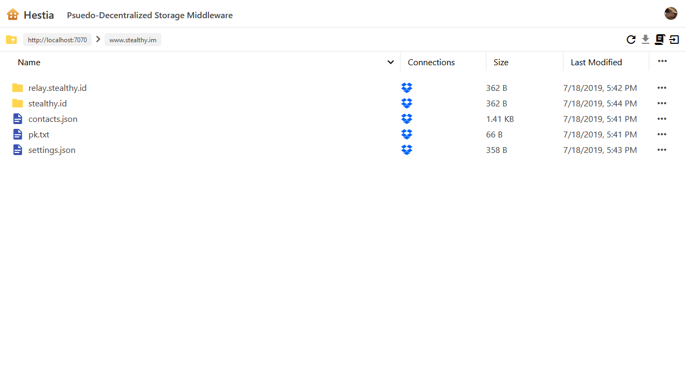

# Hestia

*Pseudo-Decentralized Storage Middleware, or in other words, a Multi-Backend Gaia Hub*



[](https://ko-fi.com/michaelfedora)

## Feature Overview

- Gaia Compatability
  - To use as your Gaia Hub, simply use `{your hestia node url}/gaia`!
  - Uses Gaia Authentication token format for simplicity and ease-of-use
- Easily configurable with many whitelisting options
- Uses a Database for storing metadata, indexing the files, and storing user preferences
  - This improves performance when looking up your files instead of just assuming they all
  exist.
- Advance Drivers
  - Multi-Instance: Run more than one driver of a particular type with different
  configuration options
  - Multi-User: Run one driver that supports individual users (for remote cloud storage
  like Dropbox)
  - "Root Only": Only writing the root folder (profile.json and avatar), to limit storage
  use and encourage users to use their own remote backends
- Plugins
  - From making backups-on-request to providing a dashboard, it's all possible through the
  Plugin API Interface

Doc Shortcuts:
- [About / Goals](#about--goals)
- [Installation / Setup](#installation--setup)
- [Configuration](#configuration)
- [Api](#api)
- [DB Drivers](#db-drivers)
- [Drivers](#drivers)
- [Plugins](#plugins)
- [Building & Testing](#building--testing)
- [License](#license)

## About / Goals

### Background

> I am simply trying to finish what Blockstack started in regards to Gaia – or rather,
> to try and fulfill the original goal in a different way. I wanted Users to be able to
> use their own Dropbox without having to spin up their own node and all of the complexity
> that doing so brings – so why not have a pseudo-centralized service handle it all for
> them? And beyond that, why not have the ability to hook up multiple backends (as
> advertised in the whitepaper) that can replicate or be given to a particular app at
> the user’s choosing?
>
> If you want to get into blockstack easily, use this; if you are concerned about
> centralization but still want the ease-of-use this brings, run your own node; if you
> want to go as deep as you can, run multiple of your own gaia hubs and use a browser
> that supports that (if any exist currently).
> - Michael Fedora, from [here](https://forum.blockstack.org/t/8476/17?u=michaelfedora).

### Explanation

The goal of Hestia is to serve as a more complex
[Gaia Hub](https://github.com/blockstack/gaia). While the original software works well,
it works simply and cannot solve certain problems, such as those posed by using personal
cloud storage providers as backends while also allowing any end-user to do so.

Hestia was made so that any Blockstack user could use their personal cloud storage
(i.e. Dropbox, Google Drive, etc) as their own storage backend, i.e. to have full control
over both ends (writing the files and accessing the backend). While this node, which
serves as middleware, is still controled by a third-party, it can easily be run by
any user as well, whether for themselves, for their family, or their organization.

```
End User -> Gaia -> Amazon S3 (Node Owned Backend)
End User -> Hestia -> End User's Dropbox (User Owned Backend)
```

In addition, because of its inherent complexity, more features have been added to allow
extension by third party plugins and other drivers, whether locally created or imported
through `npm`. There are also more configuration options on the default drivers, such as
the Disk driver being able to limit how much overall storage it is using, as well as
how much each user is allowed to store. Hestia can also whitelist drivers as well as
limit a driver to only being able to be used as an identity folder -- i.e. only a
user's profile.json and avatar will be stored on the driver backend, and all other apps
that attempt to use the driver will fail.

Hestia also provides a singular Gaia interface for all backends -- this means the user
manages what drivers handle what buckets. For instance, an end-user could have their Dropbox
handle Stealthy data, while their Google Drive can handle their Travelstack data, and their
One Drive gets everything. All drivers get your identity folder, however, and some drivers
allow you to use them more than once; for instance, you could attatch two dropbox instances to
your account if you so desired -- but you can only have one disk driver per driver instance.

```md
User Connections:
- Disk (identity only, 5mb limit)
- Dropbox 1 (personal, 2gb limit, default (store everything))
- Dropbox 2 (team, 2gb limit, stealthy.im only)
```

Of course, with all of this complexity, there will be some downsides:
- It is required to use an association token for every request, as the Hestia Hub needs to know
the end-user's address to be able to read the connection information
- Connection information (such as dropbox tokens) are stored unencrypted within the Hestia Hub
  - These can obviously still be revoked, and this should not seem more unsecure than any other
  app requesting to use your dropbox.
- File metadata and their paths are stored in the local database, unencrypted
  - While it could be concerning because of how easy it is to get it, reading a Gaia Hub's
logs (or the server's HTTP logs) would get you the same information.

[Back to top](#)

## Installation / Setup

- `npm i`
- `npm run build-prod`
- Copy `config.sample.json`, rename to `config.json` and configure (see:
[Configuration](#configuration) below)
- `npm start`

[Back to Top](#)

## Configuration

A sample config file is provided in [`config.sample.json`](config.sample.json), but
here is an annotated configuration below:

```typescript
interface Config {
  port: number; // The port to serve the application on
  ip: string; // The ip (generally `0.0.0.0`) to serve the application on
  protocol: string; // The protocol (`http` or `https`) to serve the application on
  server_name: string; // The server name (e.x. `localhost:{port}` or `Hestia.otorno.cc`)
  valid_hub_urls?: string[]; // (optional) Other valid hub urls for apps to make requests to

  db_driver_path?: string; // (optional) the path where the db driver is located
                          //     (default: `default-db-drivers/sqlite3`)
  db_driver_config?: any; // (optional) the config for the db driver

  pm2?: boolean; // (optional) whether or not you are using pm2 (for logging issues)
  pm2InstanceVar?: string; // (optional) the instance ID if it is not default

  whitelist?: string[]; // (optional) A list of addresses which are whitelisted to use the node

  max_blob_size?: string | number; // (optional) The maximum blob size for files (i.e. "5mb", 5242880)
                                   // default is 7.5mb
  page_size?: number; // The pagination size for list-files

  root_plugin?: string; // The plugin to use as the `/` plugin, i.e. for a web interface

  // driver configs
  drivers: {
    [id: string]: { // this driver ID
      path: string; // the path where the driver is located
      name?: string; // (optional) a different name to use then the standard one
      icon_url?: string; // (optional) a url to use for the icon instead of the default provided one
      whitelist?: string[]; // (optional) a whitelist of users who can use the driver
      auto_register?: boolean; // (optional) whether or not users should be auto-registered for the
                              // driver when their account is registered
      root_only?: boolean; // (optional) whether or not the driver should only be allowed for
                          // the root (identity) directory
    } 
  };

  // plugin configs
  plugins: {
    [id: string]: { // the plugin ID
      path: string; // the path to the plugin for `import({path})`
    }
  };
}
```

[Back to top](#)

## API

### Token Types

Most routes need some sort of authentication token in order to work properly, but in
general there are four types of routes:
- Those that do not need any ("**None**")
- Those that need normal gaia bucket authentication ("**Bucket**")
  - See the [`Gaia Hub`](https://github.com/blockstack/gaia) Repo for specs
- Those that only partially check the token ("**Partial**")
  - Based off of the Bucket token, but does not check for the user existing, or that
the claimed Gaia-Hub in the token is the actual Hestia Hub
- Those that need what is called a "user" authentication ("**User**")
  - A Bucket token that is either authed for the Hestia Hub itself as if it were an app
  (i.e. properly issued to `server_name`) or one that is issued for the Id's root bucket
  (i.e. if the issuer and signer are the same address).

Any token besides ones for which the signer and issuer are equal need to be signed with
an "Association Token," which is a sub-token inside of the overarching token. Please see
the [`Gaia Hub`](https://github.com/blockstack/gaia) Repo for more information on the
structure of both the normal token and the association token.

### Meta Routes (**`/`**)

| HTTP Method | Url | Token Type(s) | Description |
|-------------|-----|---------------|-------------|
| GET | `/env` | None | Get the current NODE_ENV |
| * | `/plugins/{id}/...` | None, User | Use the plugin routes. See the specific plugins for documentation.
| GET | `/manifest.json` | None | A computed `manifest.json` that is generated from the config file, for logging into the Hestia Hub with Blockstack authentication. |

### Gaia Routes (**`/gaia`**)

The gaia route group, of which all (should) align with the spec listed in the
[`Gaia Hub`](https://github.com/blockstack/gaia) repo. This route is what is used in
browser configurations which need a link to your gaia hub (i.e. `server_name/gaia`).

| HTTP Method | Url | Token Type(s) | Description |
|-------------|-----|---------------|-------------|
| GET | `/gaia/hub_info` | None | Read the hub info. |
| GET | `/gaia/read/{address}/{path}` | None | Read a file from the given bucket address and file path. |
| POST | `/gaia/store/{address}/{path}` | Bucket, User | Store a file to the given bucket address and path. Post the contents as a body or urlencoded stream, preferably with a content-type and content-length. |
| DELETE | `/gaia/delete/{address}/{path}` | Bucket, User | Delete the file given by the bucket address and path. |
| POST | `/gaia/list-files/{address}` | Bucket, User | List the files in the given bucket. Within the body, put a JSON object with `{ state?: boolean, page?: number }` to specify whether or not to return "state" info, and the page number. See below for return types. |
| POST | `/gaia/revoke-all/{address}` | Bucket, User | Revoke all tokens in the given bucket up to a value (in seconds) in the body which is formatted as so: `{ oldestValidTimestamp: number }`. |

*Return type for `/gaia/list-files/{address}` with `state` as `false` or undefined:*
```typescript
{
  entries: string[]; // full-length paths of files
  page?: number; // the next page, if it exists
}
```

*Return type for `/gaia/list-files/{address}` with `state` as `true`:*
```typescript
{
  entries: {
    name: string; // full-length path of the file
    contentLength: number; // the size of the file
    lastModifiedDate: number; // the unix timestamp of when the file was last modified
  }[];
  page?: number; // the next page, if it exists
}
```

### API Routes (**`/api/v1`**)

| HTTP Method | Url | Token Type(s) | Description |
|-------------|-----|---------------|-------------|
| GET | `/api/v1/plugins` | None | Returns the list of plugins and their IDs, as well as whatever info they want to include in the `getInfo` function. |
| GET | `/api/v1/drivers` | None, User | Return the available drivers and, if logged in, the current connections like so: `{ current?: { id: string, name: string, longId: string, driver: string, rootOnly?: boolean }[], available: { id: string, name: string, longId: string, rootOnly?: boolean, multiUser?: boolean }[]`. |
| GET | `/api/v1/drivers/{id}/icon` | None | Get the icon for a particular driver. |
| GET | `/api/v1/drivers/{id}/register` | User | Register for a particular driver (use in a new window) -- start the auth flow by putting the auth token the query parameter `?authorizationBearer={token}`. |

### User Routes (**`/api/v1/user`**)

| HTTP Method | Url | Token Type(s) | Description |
|-------------|-----|---------------|-------------|
| POST | `/api/v1/user/validate-token` | User | Validates the token used to see if it is valid in regards to using the API with it. |
| POST | `/api/v1/user/register` | Partial* | Registers the user to the Hestia Hub and auto-registers them for any drivers that are labeled as such. While being partial, it does require the claimed hub to be the Hestia Hub. |
| POST | `/api/v1/user/unregister` | User | Unregisters the user from all drivers and then deletes the user from the database. |
| GET | `/api/v1/user/list-files?global={boolean}&hash={boolean}` | User | Lists all files and metadata; if the `global` query is set to true, it will include every conneciton (not just the up-to-date ones), and if hash is specified to true, it will simply return a hash of the table to reduce traffic if nothing has changed. See return type below this table.
| GET | `/api/v1/user/gdpr` | User | Gets a JSON'd file of the user object stored in the database. Be careful, as this includes any and all tokens and keys generated for the driver connections, as well as the metadata indexes. |

*Return type of `/api/v1/user/list-files`*
```typescript
{
  [path: string]: {
    contentType: string;
    size: number;
    hash: string;
    lastModified: string;
    connIds: string[]
  }
}
```
*Return type of `/api/v1/user/list-files?global=true`*
```typescript
{
  [path: string]: {
    [connId: string] {
      contentType: string;
      size: number;
      hash: string;
      lastModified: string;
    }
  }
}
```

### Connection Routes (**`/api/v1/connections`**)

All routes within the `/api/v1/connections` group require an authed user token, and some of
them are very similar to the routes found under `/gaia`. One trait they do all share in
common, however, is that the very first parameter is the `{id}` field, which is the connection
ID itself -- you can get this from the `current` sub-object in the `/drivers` return object
(when requested with a valid token).

| HTTP Method | Url | Token Type(s) | Description |
|-------------|-----|---------------|-------------|
| POST | `/api/v1/connections/{id}/set-default` | User | Set this connection to be the "default", which means that all new store requests will be forwarded to this address if they are not already configured to go to a specific one. |
| GET | `/api/v1/connections/{id}/info` | User | Get the info for a particular connection; returns `{ spaceUsed?: number, spaceAvailable?: number }`. |
| DELETE | `/api/v1/connections/{id}` | User | Delete the connection -- **NOTE:** this may or may not clear the data in the backend, and all data within the connection is assumed to be lost. |
| POST  | `/api/v1/connections/{id}/set-buckets` | User | Set the bucket addresses for the connection; put a `string[]` in the body, in JSON format. |
| POST | `/api/v1/connections/{id}/store/{address}/{path}` | User | See `/gaia/store`. |
| GET | `/api/v1/connections/{id}/read/{address}/{path}` | User | See `/gaia/read`. This one still requires the user to be authenticated because connection IDs are not unique across all users. |
| DELETE | `/api/v1/connections/{id}/delete/{address}/{path}` | User | See `/gaia/delete`. |
| POST | `/api/v1/connections/{id}/list-files/{bucket?}` | User | Similar to the `/gaia/list-files` except that it doesn't require an address (though it can be provided), as it can list all files and also includes metadata; returns `{ entries: { path: string, size: number, hash: string, lastModified: string }[], page?: number }`

[Back to top](#)

## DB Drivers

Database drivers can be selected by setting the `db_driver_path` entry in the `config.json`
to a path that can be used to import it; `default-db-drivers` is the prefix for using default
drivers, otherwise you can use a relative import (from the root directory where `hestia.js` is
run from -- i.e when using `npm start` it will be the root repository directory), or an import
from `node_modules` as you would normally do from a script (i.e. `npm i my-hestia-db-driver`
and then, in the `config.json`, `"path":` would be `"my-hestia-db-driver"` and that's it).

Default database drivers are the Sqlite3 driver (`default-drivers/sqlite3`), which is the one
Hestia will use if none is specified, and the RethinkDB driver `default-drivers/rethinkdb`.

### DB Driver Configuration

View each database driver's docs to see how it needs to be configured specifically.

For the default database drivers, see below:

```typescript
// path: `default-db-drivers/sqlite3`
interface SQLite3Config {
  filename?: string; // (optional) the filename of the database to use
                     // default is `hestia-db.sqlite`
}

// path: `default-db-drivers/sqlite3`
interface RethinkDBConfig {
  host?: string; // (optional) the RethinkDB host (default: `127.0.0.1`)
  port?: number; // (optional) the RethinkDB port (default: `28015`)
}
```

[Back to top](#)

## Drivers

Drivers can be included by adding them in the `config.json`. The `path` field is used to
import them; `default-drivers` is the prefix for using default drivers, otherwise you can use
a relative import (from the root directory where `hestia.js` is run from -- i.e when using
`npm start` it will be the root repository directory), or an import from `node_modules` as you
would normally do from a script (i.e. `npm i my-hestia-driver` and then, in the `config.json`,
`"path":` would be `"my-hestia-driver"` and that's it).

Default drivers are the Disk driver (`default-drivers/disk`), which allows you to use the local
harddisk and the User-Dropbox driver (`default-drivers/user-dropbox`), which allows users to use
their own Dropbox account (and also fulfills one of the goals of this project).

### Driver Configuration

Every driver can take the following options:

```typescript
export interface DriverConfig {
  path: string; // the path where the driver is located
  name?: string; // (optional) a different name to use then the standard one
  icon_url?: string; // (optional) a url to use for the icon instead of the default provided one
  whitelist?: string[]; // (optional) a whitelist of users who can use the driver
  auto_register?: boolean; // (optional) whether or not users should be auto-registered for the
                           // driver when their account is registered
  root_only?: boolean; // (optional) whether or not the driver should only be allowed for
                       // the root (identity) directory
}
```

> **Tip:** `root_only` is a fantastic option so that users can automatically register for your
> Hestia Hub without going through the hoops to register their own storage backend first. For
> instance, if you are limited on Disk space, but want to make it easy for users to get started
> using your hub, simply use the disk driver (below), limit it to `5mb` or less for each user,
> and make it root only -- Users will automatically be able to register to the Hestia Hub, but
> will have to register another driver in order to actually use it for apps.

View each drivers's docs to see how it needs to be configured.

For the default drivers, see below:

```typescript
// path: `default-drivers/disk`
interface DiskDriverConfigType {
  storage_root_directory: string; // the directory to put the files (default: `./Hestia-storage`)

  // for storage caps (below), use a number of bytes or a string representation (i.e. "5mb")
  max_user_storage: string | number; // the storage cap for each  user (default: unlimited)
  max_total_storage: string | number; // the overall storage cap for Hestia (default: unlimited)
}

// path: `default-drivers/user-dropbox`
interface UserDropboxDriverConfig {
  client_id: string; // the client Id for the http dropbox API
  secret: string; // the client secret for the http dropbox API
}

// **NOTE**: When using this driver, make sure your Hestia Hub's max_blob_size is LESS THAN OR
// EQUAL TO the Gaia Buckets you are connected to -- otherwise syncing will fail because the
// remote gaia server will fail repeatedly. It WILL NOT separate files into parts for you.
//
// path: `default-drivers/gaia`
interface GaiaDriverConfig {
  token?: string; // (optional - required for hub-backend) the authorization token
                  // if not provided, this will be a per-user backend
}
```

[Back to top](#)

## Plugins

Plugins can be included by adding them in the `config.json`. The `path` field is used to
import them; `default-plugins` is the prefix for using default plugins, otherwise you can use
a relative import (from the root directory where `hestia.js` is run from -- i.e when using
`npm start` it will be the root repository directory), or a import from `node_modules` as you
would normally do from a script (i.e. `npm i my-hestia-plugin` and then, in the `config.json`,
`"path":` would be `"my-hestia-plugin"` and that's it).

Default plugins are the Dashboard plugin (`default-plugins/dashboard`), which adds the Hestia
frontend to the server (and must be the `root_plugin` in order to work properly), and the
Backup plugin (`default-plugins/backup`), which adds backup functionality to the Hestia Hub.
Currently there are a couple of other plugins in the directory but they are still under
construction.

There are no routes added by the Dashboard plugin (besides the root route, which is the
dashboard webpage itself), but the Backup plugin adds three, all of which require an authenticated user
(replace `/plugins/backup` with `/plugins/{your chosen id}` for your own instance):

| HTTP Method | Url | Token Type(s) | Description |
|-------------|-----|---------------|-------------|
| POST | `/plugins/backup/request-backup` | User | Requests a backup to be started. |
| GET | `/plugins/backup/status` | User | Checks the status of the backup for the user; returns `{ status: 'ready' | 'working' | 'not started' }`, where `ready` means the download is ready. |
| GET | `/plugins/backup/download` | User | Acts as a download link to the (large) backup zip file. |

### Plugin Configuration

Every plugin config requires a `path` field to specify where it is located at:

```typescript
interface PluginConfig {
  path: string; // the path where the plugin is located
}
```

View each plugin's docs to see how it needs to be configured specifically.

For the default plugins, see below:

```typescript
// path: `default-plugins/dashboard`
interface DashboardPluginConfig {
  root_directory?: string; // defaults to `__dirname/../../frontend"`
                           // (i.e. `./build/frontend` or `./build-prod/frontend`)
}

// path: `default-plugins/backup`
interface BackupPluginConfig {
  temp_directory?: string; // default: `__dirname/backups`
                           // (i.e. `./build/backend/default-plugins/backups`)
}
```

[Back to top](#)

## Building & Testing

- `npm run build` - build debug, output to `./build`
  - `npm run build:backend`- just build (debug) the backend
  - `npm run build:frontend`- just build (debug) the frontend
- `npm test` - start the debug build (`./build`)

- `npm run build-prod` - build prod, output to `./build-prod`
- `npm start` - start the prod build (`./build-prod`)

[Back to top](#)

## License

Released under [Mozilla Public License 2.0](LICENSE.md), with graphics under
[CC BY-SA 4.0.](https://creativecommons.org/licenses/by-sa/4.0/)

What the code license means is that you are free to fork and modify the project,
**but any changes to *this* code should be given back via pull requests**. Snippets
are generally ok to take, and *your own plugins, drivers, and db drivers* do not
need to be added to this repo -- those are yours to license as you will. Of course,
I am not a lawyer, so go ask one if you need further help.

The graphics license means that if you take my graphics, you can derive or republish
them at will, as long as you give me attribution and share under the same license.

[Back to top](#)
